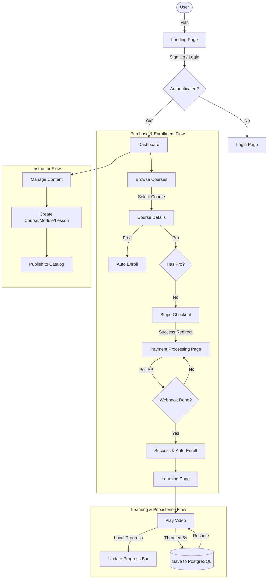
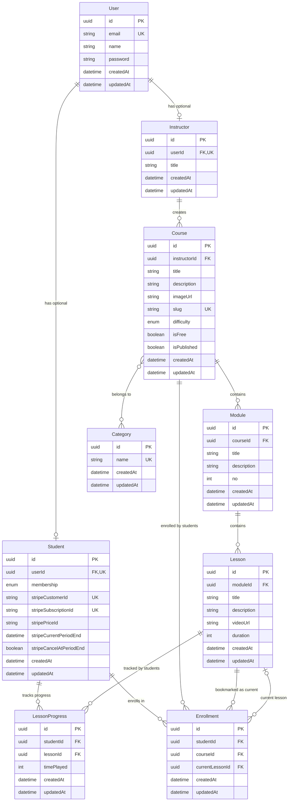

# Online Courses Platform (LMS)

A full-stack Learning Management System built with Next.js 16, featuring database-driven content management, payment processing, and progress tracking.

## 🌟 Features & Functionality

### 1. Learning Experience
-   **Progress Tracking**: Tracks lesson completion and video progress so students can resume where they left off.
-   **Course Discovery**: Search functionality with category filtering, difficulty indicators, and pagination.
-   **Video Player**: Media player using `media-chrome` and `react-player` with throttled persistence.
-   **Dashboards**: Student and instructor views for tracking progress and managing content.

### 2. Payment System
-   **Stripe Integration**: Uses Stripe Webhooks and a polling-based approach to handle potential timing issues during checkout.
-   **Tiered Membership**: Support for Free and Pro tiers with role-based access control.
-   **Subscription Management**: Handles subscription updates, renewals, and cancellations synchronized with the database.

### 3. Technical Implementation
-   **Type Safety**: TypeScript and Zod validation for Server Actions and API routes.
-   **Architecture**: Built with Next.js 16 App Router, Server Components, and Server Actions.
-   **Testing**: Unit and integration tests with Vitest and Playwright.

---

## 🔄 Application Workflow


```mermaid
graph TD
    User([User]) -->|Visit| Landing[Landing Page]
    Landing -->|Sign Up / Login| Auth{Authenticated?}
    Auth -- No --> Login[Login Page]
    Auth -- Yes --> Dashboard[Dashboard]

    subgraph "Purchase & Enrollment Flow"
        Dashboard --> Browse[Browse Courses]
        Browse -->|Select Course| Details[Course Details]
        Details -->|Free| Enroll[Auto Enroll]
        Details -->|Pro| CheckSub{Has Pro?}
        CheckSub -- No --> Stripe[Stripe Checkout]
        Stripe -->|Success Redirect| Polling[Payment Processing Page]
        Polling -->|Poll API| CheckDB{Webhook Done?}
        CheckDB -- No --> Polling
        CheckDB -- Yes --> Success[Success & Auto-Enroll]
        Success --> Learning
    end

    subgraph "Learning & Persistence Flow"
        Learning[Learning Page] --> Play[Play Video]
        Play -->|Local Progress| UI[Update Progress Bar]
        Play -->|Throttled 5s| DB[(Save to PostgreSQL)]
        DB -->|Resume| Play
    end

    subgraph "Instructor Flow"
        Dashboard --> Manage[Manage Content]
        Manage --> Create[Create Course/Module/Lesson]
        Create --> Publish[Publish to Catalog]
    end
```

---

## 🛠 Tech Stack & Strategies

### Core Technologies
-   **Framework**: [Next.js 16](https://nextjs.org/) (App Router, Server Actions)
-   **Language**: [TypeScript](https://www.typescriptlang.org/)
-   **Database**: PostgreSQL via [Prisma ORM](https://www.prisma.io/)
-   **Styling**: [Tailwind CSS v4](https://tailwindcss.com/) (using `@theme` design tokens)
-   **Authentication**: [NextAuth.js](https://next-auth.js.org/) (Custom RBAC)
-   **Payments**: [Stripe API](https://stripe.com/) (Checkout & Webhooks)

### Client-Side Tools
-   **Video**: `media-chrome`, `react-player`
-   **Icons**: `lucide-react`
-   **State Management**: React Context (Course Provider) + Server Actions
-   **Validation**: `zod`

### Implementation Details
-   **Path Aliases**: Uses `@/` imports for cleaner code organization.
-   **Throttled Updates**: Video progress is saved every 5 seconds to reduce database load.
-   **Polling Strategy**: A `PaymentBeingProcessed` page polls the backend to verify webhook completion.
-   **Dockerization**: Multi-stage Docker builds for development and production.

---

## 🏗 Deep Dive: Technical Implementation

### 💳 Payment Flow
To handle potential timing issues with webhooks, the checkout flow includes a polling mechanism:

1.  **Checkout Initiation**: User is redirected to Stripe Checkout with metadata (studentId, courseSlug).
2.  **Webhook Processing**: Stripe sends a `checkout.session.completed` event to our API. Our server updates the Student record and **auto-enrolls** the student in the target course.
3.  **Client-Side Polling (`payment-being-processed.tsx`)**: 
    -   While the webhook processes in the background, the user is redirected to a processing page.
    -   This page polls `/api/check-subscription` and `/api/enrollment` every 2 seconds.
    -   Once the database reflects the changes from the webhook, the UI shows a "Success" state and redirects the user to the course.
    -   Includes a 60-second timeout and manual dashboard redirect option if needed.

### 🎥 Progress Tracking & Persistence
The platform includes a persistence layer for tracking student progress:

-   **Client-Side**: The `VideoPlayer` component listens to `onProgress` events. It updates the global `CourseProvider` context immediately to reflect progress in the sidebar and UI.
-   **Server-Side**: To avoid overwhelming the database with every second of video playback, the `updateLessonProgress` Server Action is **throttled**. It only commits to PostgreSQL when:
    1.  The user has watched 5 new seconds of content.
    2.  The user manually seeks to a different part of the video.
-   **Resume Logic**: When a student opens a lesson, the system fetches their `LessonProgress` and automatically seeks the video to their last saved timestamp.

---

## 📂 Project Structure

The project follows a modular structure:

```text
.
├── actions/                # Server Actions (Business logic & Database mutations)
│   ├── checkEnrollment.ts  # Logic to verify student course access
│   ├── createEnrollment.ts # Enrollment creation logic
│   ├── getAllCategories.ts # Fetching course categories for filtering
│   ├── getAllCourses.ts    # Main course retrieval with search/pagination
│   ├── getAllEnrollments.ts # Fetch all enrollments for a student
│   ├── getCourseBySlug.ts  # Course details retrieval by slug
│   ├── getEnrollment.ts    # Individual enrollment lookup
│   ├── progress.ts         # Video progress & lesson completion tracking
│   ├── register.ts         # User registration & profile initialization
│   ├── settings.ts         # User settings management
│   ├── subscription.ts     # Stripe subscription state management
│   └── index.ts            # Centralized action exports
├── app/                    # Next.js App Router (Routing & Pages)
│   ├── (auth)/             # Authentication routes (Login, Register)
│   │   ├── login/          # Login page
│   │   └── register/       # Registration page
│   ├── (dashboard)/        # Protected student & billing routes
│   │   ├── billing/        # Subscription & payment management
│   │   ├── learning/       # Course learning environment
│   │   │   └── [courseSlug]/ # Dynamic course learning page
│   │   ├── overview/       # Student progress summary dashboard
│   │   ├── payment-required/ # Access restriction page for Pro courses
│   │   └── settings/       # Account & profile management
│   ├── (public)/           # Unprotected routes (Landing, Course Catalog)
│   │   ├── courses/        # Course catalog with search & filtering
│   │   │   ├── [courseSlug]/ # Individual course detail page
│   │   │   └── _components/ # Course-specific components
│   │   ├── payment-being-processed/ # Payment polling & verification page
│   │   └── pricing/        # Membership plan comparison
│   ├── api/                # API Route Handlers
│   │   ├── auth/           # NextAuth configuration
│   │   ├── checkout/       # Stripe Checkout Session creation
│   │   ├── check-subscription/ # Subscription status verification
│   │   ├── enrollment/     # Enrollment status checks
│   │   ├── settings/       # Settings update endpoints
│   │   └── webhooks/       # Stripe Webhook event handlers
│   │       └── stripe/     # Stripe-specific webhook processing
│   └── generated/          # Auto-generated Prisma client code
│       └── prisma/         # Prisma client types and models
├── components/             # Reusable UI Components
│   ├── auth/               # Authentication-related components
│   ├── layout/             # Shared structural components (Sidebar, Navbar)
│   ├── provider/           # React Context Providers (Course, Session)
│   └── ui/                 # Core UI building blocks
│       ├── VideoPlayer.tsx # Custom video player with progress tracking
│       ├── CourseCard.tsx  # Course display card component
│       ├── FreeAccessButton.tsx # Free course enrollment button
│       ├── ProUpgradeButton.tsx # Pro upgrade CTA button
│       └── Skeleton.tsx    # Loading skeleton components
├── lib/                    # Shared Utilities & Configurations
│   ├── auth.ts             # NextAuth strategies & callbacks
│   ├── auth-wrapper.ts     # Server-side auth utility wrappers
│   ├── courseUtils.ts      # Formatting & course-specific helpers
│   ├── env.ts              # Environment variable validation
│   ├── prisma.ts           # Database client singleton
│   ├── stringUtils.ts      # String manipulation utilities
│   ├── stripe.ts           # Stripe client initialization
│   └── utils.ts            # General utility functions (cn, etc.)
├── prisma/                 # Database Layer
│   ├── schema.prisma       # Database model definitions
│   ├── seed.ts             # Production & development seeding logic
│   └── migrations/         # Database migration history
├── e2e_tests/              # Playwright End-to-End test suites
├── types/                  # TypeScript type definitions
│   └── next-auth.d.ts      # NextAuth type extensions
└── public/                 # Static assets (images, videos, etc.)
    └── screenshots/        # App screenshots for documentation
```

---

## 🗄️ Database Schema

The application uses PostgreSQL with Prisma ORM. Below is the entity-relationship diagram showing the database structure:


```mermaid
erDiagram
    User ||--o| Instructor : "has optional"
    User ||--o| Student : "has optional"
    User {
        uuid id PK
        string email UK
        string name
        string password
        datetime createdAt
        datetime updatedAt
    }

    Instructor ||--o{ Course : "creates"
    Instructor {
        uuid id PK
        uuid userId FK,UK
        string title
        datetime createdAt
        datetime updatedAt
    }

    Student ||--o{ Enrollment : "enrolls in"
    Student ||--o{ LessonProgress : "tracks progress"
    Student {
        uuid id PK
        uuid userId FK,UK
        enum membership
        string stripeCustomerId UK
        string stripeSubscriptionId UK
        string stripePriceId
        datetime stripeCurrentPeriodEnd
        boolean stripeCancelAtPeriodEnd
        datetime createdAt
        datetime updatedAt
    }

    Course ||--o{ Module : "contains"
    Course ||--o{ Enrollment : "enrolled by students"
    Course }o--o{ Category : "belongs to"
    Course {
        uuid id PK
        uuid instructorId FK
        string title
        string description
        string imageUrl
        string slug UK
        enum difficulty
        boolean isFree
        boolean isPublished
        datetime createdAt
        datetime updatedAt
    }

    Module ||--o{ Lesson : "contains"
    Module {
        uuid id PK
        uuid courseId FK
        string title
        string description
        int no
        datetime createdAt
        datetime updatedAt
    }

    Lesson ||--o{ LessonProgress : "tracked by students"
    Lesson ||--o{ Enrollment : "bookmarked as current"
    Lesson {
        uuid id PK
        uuid moduleId FK
        string title
        string description
        string videoUrl
        int duration
        datetime createdAt
        datetime updatedAt
    }

    Enrollment }o--o| Lesson : "current lesson"
    Enrollment {
        uuid id PK
        uuid studentId FK
        uuid courseId FK
        uuid currentLessonId FK
        datetime createdAt
        datetime updatedAt
    }

    LessonProgress {
        uuid id PK
        uuid studentId FK
        uuid lessonId FK
        int timePlayed
        datetime createdAt
        datetime updatedAt
    }

    Category {
        uuid id PK
        string name UK
        datetime createdAt
        datetime updatedAt
    }
```

### Key Relationships

-   **User** → One-to-One with `Instructor` OR `Student` (role-based profiles)
-   **Instructor** → One-to-Many with `Course` (instructors create multiple courses)
-   **Course** → One-to-Many with `Module` (courses contain multiple modules)
-   **Module** → One-to-Many with `Lesson` (modules contain multiple lessons)
-   **Student** → Many-to-Many with `Course` through `Enrollment` (students enroll in courses)
-   **Student** → Many-to-Many with `Lesson` through `LessonProgress` (tracks video progress)
-   **Course** → Many-to-Many with `Category` (courses can have multiple categories)
-   **Enrollment** → Optional reference to `Lesson` (bookmarks current lesson)

---

## 🏁 Getting Started

1.  **Clone & Install**:
    ```bash
    git clone https://github.com/yourusername/online-courses.git
    npm install
    ```
2.  **Database Setup**:
    ```bash
    npx prisma generate
    npx prisma db push
    ```
3.  **Environment Variables**:
    Configure `.env` with `DATABASE_URL`, `NEXTAUTH_SECRET`, and `STRIPE_SECRET_KEY`.
4.  **Run**:
    ```bash
    npm run dev
    ```

## 🧪 Quality Assurance

-   **Unit Tests**: `npm run test` (Vitest + React Testing Library)
-   **E2E Tests**: `npm run test:e2e` (Playwright)
-   **Linting**: `npm run lint` (ESLint 9)

## 🐳 Deployment

Configured for **Vercel** + **Neon PostgreSQL**. See [DEPLOYMENT.md](DEPLOYMENT.md) for deployment details.

---
*Built with ❤️*
